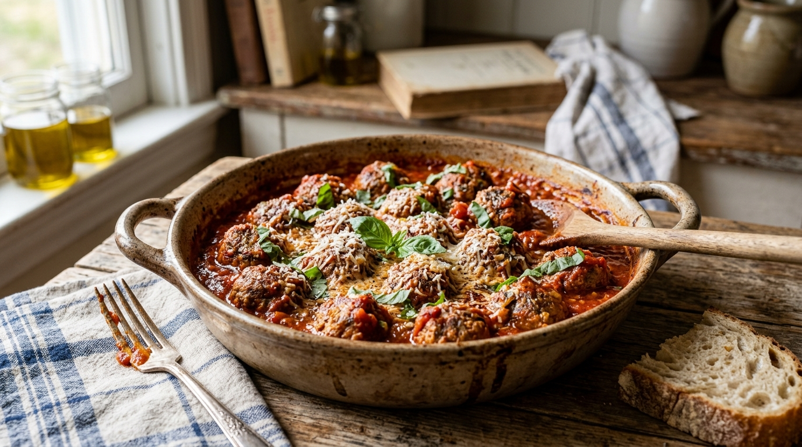

# Almôndegas da Vovó ao Molho de Tomate 🧆🍅 📝

*Nada se compara ao perfume que invade a casa nas manhãs de domingo quando a vovó começa a dourar as almôndegas e apurar o molho de tomate. Esta receita é daquelas carregadas de carinho, memória e sabor de infância. Bolinhas de carne extremamente macias, úmidas e bem temperadas, cozidas lentamente num molho rústico de tomates frescos e manjericão, prontas para abraçar um bom prato de macarrão ou serem saboreadas com fatias generosas de pão caseiro.*

---

### ℹ️ Informações Gerais 📋
- **Tempo de preparo:** 45 minutos ⏱️
- **Rendimento:** 4 a 6 porções (cerca de 20 a 24 almôndegas) 🍽️
- **Categorias:** Salgado / Carnes / Prato Principal 🥩🍝

---

### 📷 Foto do Prato 🤤
  

---

### 🛒 Ingredientes 🧂

#### Almôndegas 🧆🥩
- [ ] 700 g de carne bovina moída (acém, patinho ou fraldinha com um toque de gordura) 🥩
- [ ] 1 pão francês amanhecido (ou 2 fatias de pão de forma) 🥖
- [ ] 1/2 xícara (chá) de leite morno (para hidratar o pão) 🥛
- [ ] 1 ovo grande ligeiramente batido 🥚
- [ ] 1 cebola média picadinha ou ralada 🧅
- [ ] 3 dentes de alho amassados ou ralados 🧄
- [ ] 1/2 xícara (chá) de queijo parmesão ralado na hora 🧀
- [ ] 3 colheres (sopa) de cheiro-verde (salsinha e cebolinha) picadinho 🌿
- [ ] 1 colher (chá) de sal (ou a gosto) 🧂
- [ ] 1/2 colher (chá) de pimenta-do-reino moída na hora 🌶️
- [ ] 1 pitada de noz-moscada ralada 🌰
- [ ] 2 a 3 colheres (sopa) de azeite de oliva (para dourar) 🫒

#### Molho de Tomate Rústico 🍅🌿
- [ ] 2 latas de tomate pelado picado (ou 1 kg de tomates maduros sem pele picados) 🍅
- [ ] 1 cebola média picada finamente 🧅
- [ ] 3 dentes de alho laminados 🧄
- [ ] 2 colheres (sopa) de azeite de oliva 🫒
- [ ] 1/2 xícara (chá) de água quente ou caldo de legumes 🍲
- [ ] 1 ramo generoso de manjericão fresco 🍃
- [ ] 1 colher (café) de açúcar (se necessário para equilibrar a acidez) 🍬
- [ ] Sal e pimenta-do-reino a gosto 🧂🌶️

---

### 🍳 Modo de Preparo 👩‍🍳

#### 1. Preparo e Hidratação da Massa das Almôndegas 🥣
1. Em uma tigelinha, esfarele o pão amanhecido e regue com o leite morno. Deixe repousar por 5 minutos até absorver bem o líquido, amassando com um garfo até formar uma pastinha úmida (a clássica *panade* da vovó).
2. Em uma tigela grande, coloque a carne moída, o pão amolecido, o ovo batido, a cebola picadinha, o alho, o queijo parmesão ralado e o cheiro-verde.
3. Tempere com sal, pimenta-do-reino e uma pitadinha de noz-moscada.
4. Com as mãos ou uma colher, misture delicadamente todos os ingredientes apenas até ficarem incorporados. Evite sovar ou amassar em excesso para as almôndegas não ficarem compactas ou duras.

#### 2. Modelagem e Selagem 🧆🔥
1. Unte levemente as palmas das mãos com azeite ou água. Modele porções de massa em bolinhas médias regulares (do tamanho de uma noz grande ou bola de pingue-pongue).
2. Aqueça uma frigideira grande e funda (ou uma panela de fundo largo) com 2 colheres de sopa de azeite em fogo médio-alto.
3. Coloque as almôndegas aos poucos, sem superlotar a panela, e sele por cerca de 2 a 3 minutos de cada lado até dourarem por fora (não precisa cozinhar por dentro nessa fase). Retire-as com cuidado e reserve em um prato.

#### 3. Molho Rústico e Cozimento Final 🍅🍲
1. Na mesma panela em que selou as almôndegas (aproveitando todo o fundinho de sabor dourado), reduza o fogo para médio e adicione mais 1 colher de azeite se necessário.
2. Refogue a cebola picada até ficar translúcida. Acrescente o alho laminado e mexa por 1 minuto até perfumar sem queimar.
3. Adicione os tomates pelados e mexa raspando o fundo da panela com uma colher de pau para soltar a caramelização. Junte a água quente (ou caldo), tempere com sal, pimenta-do-reino e a pitadinha de açúcar se achar necessário.
4. Deixe o molho levantar fervura branda e abaixe o fogo.
5. Acomode delicadamente as almôndegas douradas dentro do molho, garantindo que fiquem semi-cobertas.
6. Tampe a panela parcialmente e deixe cozinhar em fogo baixo por cerca de 15 a 20 minutos, mexendo suavemente a panela pelas alças de vez em quando para não desmanchar as almôndegas.
7. Finalize acrescentando as folhas frescas de manjericão nos minutos finais para manter o aroma vívido.

#### 4. Como Servir 🍝🍽️
1. Sirva fumegante direto da panela ou em uma travessa funda com muito molho.
2. Combina perfeitamente sobre um espaguete ao dente, polenta cremosa, purê de batatas ou acompanhado de pão italiano crocante para mergulhar no molho. Finalize com parmesão ralado na hora! 🧀✨

---

### 💡 Dicas e Variações da Vovó ✨
- *O Segredo da Maciez da Vovó:* Nunca pule o pão amanhecido embebido em leite! Ele garante que as almôndegas fiquem aeradas, incrivelmente macias e suculentas, sem ressecar mesmo após cozidas. Se não tiver pão, você pode usar 3 a 4 colheres (sopa) de aveia em flocos finos hidratada com leite. 🍞🥛
- *Queijo na Massa:* O queijo parmesão ralado na massa é o toque de ouro da vovó para dar profundidade de sabor e umidade interna. 🧀
- *Mistura de Carnes:* Para um sabor ainda mais especial de cantina italiana tradicional, use metade carne bovina (patinho ou acém) e metade lombo suíno moído. 🥩🥓
- *Congelamento:* Você pode modelar e congelar as almôndegas cruas em uma assadeira por 2 horas, e depois transferi-las para saquinhos herméticos por até 3 meses. Basta descongelar na geladeira ou colocá-las direto no molho quente em fogo brando! ❄️

---

📖 [« Voltar para o Índice Geral](../README.md) | 🍕 [« Voltar para o Índice de Salgados](INDEX_SALGADOS.md) | 📋 [« Voltar ao Índice Completo](INDEX_COMPLETO.md)
