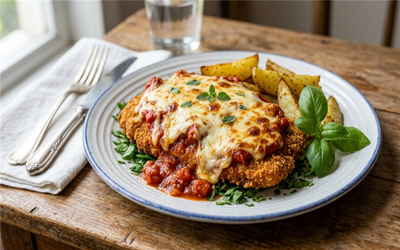

# Bife à Parmegiana 🥩🍅 📝

*Uma receita clássica, rápida e deliciosa, ideal para um almoço em família. O bife fica crocante e suculento com bastante queijo derretido por cima!*

---

### ℹ️ Informações Gerais 📋
- **Tempo de preparo:** 25 minutos ⏱️
- **Rendimento:** 5 porções 🍽️
- **Categorias:** Carnes / Salgados 🥩🧀

---

### 📷 Foto do Prato 🤤
  

---

### 🛒 Ingredientes 🧂

#### Bife 🥩🧂
- [ ] 5 bifes de patinho bovino (500 g) 🥩
- [ ] 1 sachê de Tempero SAZÓN® Vermelho 🧂
- [ ] 2 pitadas de sal 🧂

#### Empanamento 🌾🥚
- [ ] 5 colheres (sopa) de farinha de trigo 🌾
- [ ] 2 ovos ligeiramente batidos 🥚
- [ ] 1/2 xícara (chá) de farinha de rosca 🍞

#### Molho e Cobertura 🍅🧀
- [ ] 1 caixinha de polpa de tomate (520 g) 🍅
- [ ] 250 g de muçarela fatiada 🧀

---

### 🍳 Modo de Preparo 👩‍🍳

#### Preparando os Bifes 🥣
1. Em uma tigela, tempere os bifes de patinho com o Tempero SAZÓN® Vermelho e o sal.
2. Empane os bifes passando-os primeiro pela farinha de trigo, depois pelos ovos batidos e, por fim, pela farinha de rosca.
3. Frite os bifes em óleo quente até dourarem de ambos os lados. Escorra em papel absorvente.

#### Finalização 🔥
1. Disponha os bifes fritos em uma travessa ou refratário.
2. Cubra os bifes com a polpa de tomate e as fatias de muçarela.
3. Leve ao forno médio-alto por cerca de 5 minutos, ou até o queijo derreter e gratinar.
4. Sirva quente, acompanhado de arroz e batata frita, se desejar. 🍟

---

### 💡 Dicas e Variações ✨
- *Dica 1: Você pode usar filé-mignon ou alcatra no lugar do patinho, se preferir uma carne mais macia. 🥩*
- *Dica 2: Para uma versão mais leve, você pode fazer os bifes na Airfryer antes de colocar o molho e o queijo. 💨*

---

📖 [« Voltar para o Índice Geral](../INDEX.md) | 🍕 [« Voltar para o Índice de Salgados](INDEX_SALGADOS.md) | 📋 [« Voltar ao Índice Completo](INDEX_COMPLETO.md)

