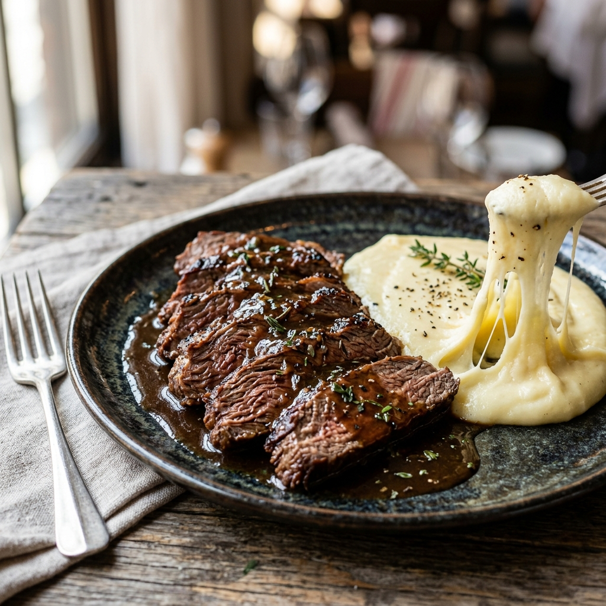

# Fraldinha na Pressão com Aligot 🍖 📝

*Uma combinação sofisticada e deliciosa. A fraldinha na panela de pressão fica extremamente macia e suculenta, cozida no próprio suco com cebolas, enquanto o aligot — um purê de batatas elástico e cremoso enriquecido com queijos nobres — traz um toque de chef sofisticado para a refeição.*

---

### ℹ️ Informações Gerais 📋
- **Tempo de preparo:** 60 minutos ⏱️
- **Rendimento:** 6 porções 🍽️
- **Categorias:** Carne Bovina / Acompanhamento / Panela de Pressão 🍖🥣
- **Autor/Origem:** Tradicional / Adaptado 👨‍🍳

---

### 📷 Foto do Prato 🤤
  

---

### 🛒 Ingredientes 🧂

#### Fraldinha na Pressão 🥩💨
- [ ] 1 peça de fraldinha (aprox. 1,5 kg a 2 kg) 🍖
- [ ] 3 cebolas grandes fatiadas em rodelas grossas 🧅
- [ ] 4 dentes de alho amassados 🧄
- [ ] Azeite de oliva a gosto 🫒
- [ ] Sal e pimenta-do-reino a gosto 🧂

#### Creme Aligot 🥔🧀
- [ ] 800g de batatas (preferencialmente tipo Asterix) 🥔
- [ ] 250g de queijo Gruyère ralado 🧀
- [ ] 250g de queijo Muçarela ralado 🧀
- [ ] 100g de manteiga sem sal 🧈
- [ ] Leite quente a gosto (apenas se necessário para dar o ponto) 🥛
- [ ] Sal a gosto 🧂

---

### 🍳 Modo de Preparo 👩‍🍳

#### Fraldinha na Pressão 🥣
1. Tempere a peça de fraldinha com sal e pimenta-do-reino a gosto. Se puder, deixe marinar por 1 hora antes do preparo.
2. Aqueça um fio de azeite na panela de pressão e sele a peça de carne inteira (ou em pedaços grandes, se não couber) de todos os lados até dourar bem, garantindo a suculência. Retire a carne temporariamente.
3. No fundo da mesma panela, monte uma "cama" com as rodelas de cebola e os dentes de alho amassados.
4. Coloque a fraldinha por cima da cama de cebolas. Não adicione água; a carne cozinhará no próprio suco e no líquido que a cebola vai soltar.
5. Tampe a panela de pressão. Assim que pegar pressão, reduza o fogo para o mínimo e cozinhe por 35 a 40 minutos.
6. Desligue o fogo, aguarde a pressão sair naturalmente, abra a panela, transfira a fraldinha para uma travessa e fatie. Reserve o caldo e as cebolas que restaram na panela para servir como molho.

#### Creme Aligot 🥣🧀
1. Descasque e cozinhe as batatas em água com sal até que fiquem bem macias.
2. Escorra e passe as batatas pelo espremedor ou por uma peneira enquanto ainda estiverem quentes, garantindo um purê liso e sem grumos.
3. Transfira o purê de batatas para uma panela, adicione a manteiga e misture bem em fogo baixo.
4. Adicione os queijos Gruyère e Muçarela ralados aos poucos, mexendo vigorosamente.
5. Continue misturando com movimentos de baixo para cima para incorporar ar e derreter os queijos por completo. Caso a mistura fique muito pesada ou seca, pingue um fio de leite quente.
6. O ponto correto é atingido quando o purê se torna elástico e elonga em fios longos ao levantar a espátula.

---

### 💡 Dicas e Variações ✨
- *Você pode substituir o queijo Gruyère por queijo Minas Padrão bem curado ou queijo Coalho ralado se preferir um toque regional brasileiro. 🧀*
- *Sirva a fraldinha fatiada sobre uma base generosa de aligot bem quente, regando tudo com o molho de cebolas caramelizadas que se formou no fundo da panela de pressão. 🤤*

---

📖 [« Voltar para o Índice Geral](../INDEX.md) | 🍕 [« Voltar para o Índice de Salgados](INDEX_SALGADOS.md)

