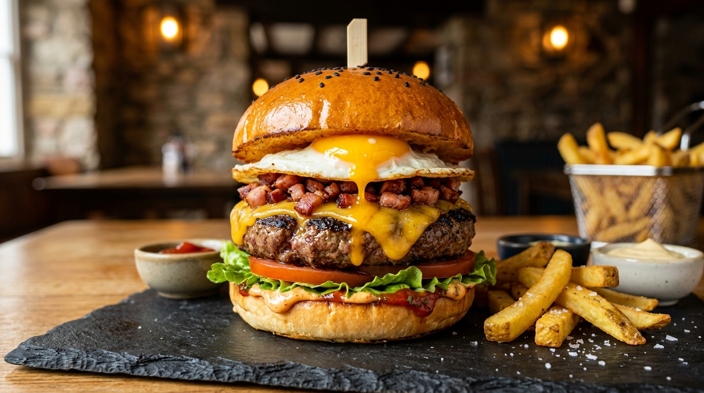

# Hambúrguer de Picanha com Bacon e Ovo 🍔🥓🍳 📝

*Aqueça a chapa e prepare o coração: este é o verdadeiro hambúrguer artesanal de lanchonete clássica levado ao nível máximo de sabor! Feito com carne de picanha pura e suculenta, acompanhado do crocante irresistível do bacon frito coberto por queijo derretido, a cremosidade inconfundível do ovo frito no ponto perfeito e a crocância refrescante da salada. Cada mordida é uma explosão equilibrada de texturas e memórias afetivas.*

---

### ℹ️ Informações Gerais 📋
- **Tempo de preparo:** 25 minutos ⏱️
- **Rendimento:** 1 porção (facilmente multiplicável) 🍽️
- **Categorias:** Salgados / Lanches / Carnes 🍔🥪🥩

---

### 📷 Foto do Prato 🤤
  

---

### 🛒 Ingredientes 🧂

#### Hambúrguer de Picanha 🥩🧂
- [ ] 120 g de picanha bovina moída com parte da sua própria gordura (blend 80/20) 🥩
- [ ] 1 pitada generosa de sal refinado ou sal de parrilla (a gosto) 🧂
- [ ] Pimenta-do-reino preta moída na hora (a gosto) 🌶️
- [ ] 1 fio de óleo ou azeite para untar a frigideira/chapa 🫒

#### Complementos e Queijo 🥓🧀🍳
- [ ] 2 a 3 tiras (ou cubinhos) de bacon de boa qualidade 🥓
- [ ] 2 fatias generosas de queijo (cheddar, prato ou muçarela) 🧀
- [ ] 1 ovo caipira fresco 🥚
- [ ] 1 pitada de sal para temperar o ovo 🧂

#### Pão e Montagem 🍞🍅🥬
- [ ] 1 pão de hambúrguer tipo brioche ou clássico com gergelim 🍞
- [ ] 1 colher (sopa) de manteiga em ponto de pomada 🧈
- [ ] 2 a 3 rodelas finas de tomate maduro e firme 🍅
- [ ] 2 folhas de alface fresca e crocante (americana ou crespa), lavadas e bem secas 🥬
- [ ] Maionese tradicional ou maionese verde artesanal (a gosto) 🥄
- [ ] Ketchup clássico (a gosto) 🍅

---

### 🍳 Modo de Preparo 👩‍🍳

#### 1. Selagem e Tostagem do Pão 🍞🧈
1. Corte o pão de hambúrguer ao meio.
2. Espalhe a manteiga generosamente na face interna das duas metades do pão.
3. Leve as fatias à frigideira ou chapa pré-aquecida em fogo médio-baixo até que fiquem uniformemente douradas e crocantes.  
   *(Essa selagem cria uma casquinha impermeabilizante protetora contra o vapor e sucos da carne).* Reserve em local seco e morno.

#### 2. Fritura do Bacon e Derretimento do Queijo 🥓🧀
1. Na mesma frigideira ou chapa, em fogo médio, doure o bacon até que fique bem dourado e crocante.
2. Junte as fatias de bacon no centro, sobreponha as 2 fatias de queijo por cima do bacon quente.
3. Pingue algumas gotinhas de água ao redor na frigideira e cubra imediatamente com uma tampa ou abafador por 30 a 45 segundos, até o queijo derreter completamente e abraçar o bacon. Transfira com cuidado para um prato de apoio.

#### 3. Ponto Perfeito do Ovo 🍳
1. Na frigideira untada com uma pontinha de manteiga ou a gordurinha que soltou do bacon, quebre o ovo delicadamente.
2. Tempere com uma pitadinha de sal sobre a gema.
3. Frite em fogo brando até que a clara esteja firme e opaca e a gema permaneça cremosa e líquida (ou frite até firmar a gema se preferir ovo bem passado). Reserve com delicadeza.

#### 4. Chapa Quente e Ponto da Picanha 🥩🔥
1. Molde a carne moída de picanha delicadamente no formato de disco com cerca de 10 a 11 cm de diâmetro, ligeiramente maior que o pão, deixando uma leve depressão com o polegar no centro (para a carne não inchar ao cozinhar).
2. Aqueça a frigideira de fundo grosso ou chapa em fogo alto até fumegar. Pincele um fiozinho fino de óleo.
3. Coloque o disco de picanha na chapa bem quente. Tempere a face superior imediatamente com sal e pimenta-do-reino moída.
4. Deixe grelhar sem mexer e **nunca aperte a carne** com a espátula (para não expulsar a suculência interna). Grelhe por cerca de 2 minutos e meio a 3 minutos para formar uma crosta caramelizada perfeita (reação de Maillard).
5. Vire o hambúrguer, tempere o outro lado com sal e pimenta e grelhe por mais 2 minutos (ponto para carne suculenta e rosada no centro).
6. Retire o hambúrguer da chapa e deixe descansar sobre uma tábua por 1 minuto antes de montar (tempo vital para os sucos se redistribuírem uniformemente nas fibras da carne).

#### 5. Montagem Estruturada e Equilibrada 🍔✨
1. **Base:** Coloque a metade inferior do pão selado e tostadinho.
2. **Camada de molho:** Espalhe uma colher de maionese cremosa.
3. **Crocância vegetal:** Acomode a alface crocante bem sequinha e as rodelas frescas de tomate.
4. **O astro do lanche:** Coloque o hambúrguer de picanha suculento e descansado.
5. **Cobertura saborosa:** Posicione com carinho o bloco de queijo derretido com bacon crocante sobre a carne.
6. **Coroamento:** Acomode o ovo frito por cima de tudo com muito cuidado.
7. **Topo:** Passe uma camada de ketchup e/ou maionese na tampa do pão e feche o lanche com leveza.
8. Sirva imediatamente e delicie-se com essa obra de arte gastronômica! 😋🍟

---

### 💡 Dicas do Chapeiro e Variações ✨
- *O descanso é sagrado:* Jamais corte ou monte a carne imediatamente após sair do fogo. Deixar repousar por 60 segundos retém toda a suculência dentro do hambúrguer, impedindo que o pão fique encharcado. ⏱️
- *Blend autêntico de picanha:* Para o melhor resultado, peça ao açougueiro para moer a picanha com a capa de gordura na proporção de aproximadamente 15% a 20% de gordura. É ela quem traz sabor profundo, maciez e aroma inigualável. 🥩
- *Ponto do ovo sob medida:* Se preferir a gema mole escorrendo, tampe a frigideira por apenas 30 segundos durante a fritura do ovo para cozinhar a clara por cima sem endurecer a gema. 🍳
- *Barreira contra umidade:* Certifique-se de que a alface e o tomate estejam 100% secos antes da montagem para manter a textura crocante e o pão firme do início ao fim da refeição. 🥬🍅

---

📖 [« Voltar para o Índice Geral](../README.md) | 🍕 [« Voltar para o Índice de Salgados](INDEX_SALGADOS.md) | 📋 [« Voltar ao Índice Completo](INDEX_COMPLETO.md)
