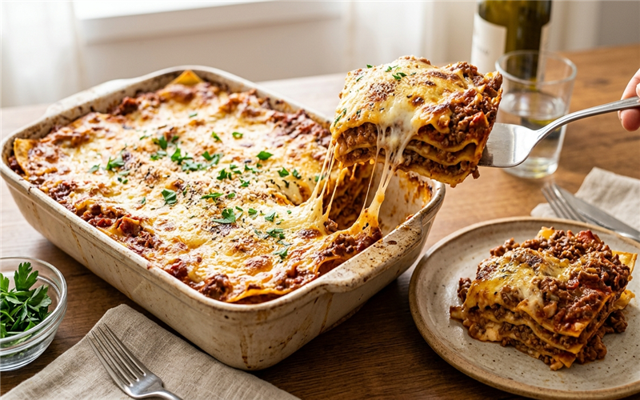

# Lasanha de Carne Moída 🍝 📝

*A clássica lasanha de carne moída, um prato muito amado e superfácil de ser feito, perfeito para aquele almoço especial de domingo com a família.*

---

### ℹ️ Informações Gerais 📋
- **Tempo de preparo:** 45 minutos ⏱️
- **Rendimento:** 6 a 8 porções 🍽️
- **Categorias:** Salgados / Massas / Prato Principal 🍝🥩

---

### 📷 Foto do Prato 🤤
  

---

### 🛒 Ingredientes 🧂

#### Massa e Recheio 🍝🧀
- [ ] 1 pacote de massa para lasanha (pré-cozida ou direto ao forno) 🌾
- [ ] 500g de presunto fatiado 🐷
- [ ] 500g de queijo mussarela fatiado 🧀
- [ ] Queijo parmesão ralado a gosto para gratinar 🧀

#### Molho à Bolonhesa 🥩🍅
- [ ] 500g de carne moída 🥩
- [ ] 1 cebola média picada 🧅
- [ ] 2 sachês de molho de tomate 🍅
- [ ] Azeite para refogar 🫒
- [ ] Sal, pimenta-do-reino e temperos a gosto 🧂

---

### 🍳 Modo de Preparo 👩‍🍳

#### Preparando o Molho 🥣
1. Em uma panela com azeite, refogue a cebola picada até ficar transparente.
2. Acrescente a carne moída e refogue até dourar e secar bem a água.
3. Tempere com sal, pimenta-do-reino e outros temperos de sua preferência.
4. Adicione o molho de tomate e deixe cozinhar em fogo baixo por alguns minutos até o molho encorpar. Desligue e reserve.

#### Montagem 🥣🧀
1. Se a massa não for do tipo "direto ao forno", cozinhe-a em água fermentando com sal conforme as instruções da embalagem antes de montar.
2. Em um refratário médio ou grande, espalhe uma camada fina de molho no fundo.
3. Faça uma camada de massa de lasanha.
4. Adicione uma camada de presunto e, logo em seguida, uma de queijo mussarela.
5. Repita o processo de intercalar camadas: molho, massa, presunto e queijo, até que todos os ingredientes terminem.
6. A última camada deve ser de queijo mussarela, finalizada com um pouco de molho e polvilhada com queijo parmesão ralado por cima.
7. Leve ao forno preaquecido a 180°C por cerca de 20 a 30 minutos, até o queijo derreter e dourar.

---

### 💡 Dicas e Variações ✨
- *Cremosidade:* Experimente intercalar as camadas de bolonhesa com um pouco de molho branco. 🥛
- *Tempero extra:* Adicione dentes de alho amassados e cheiro-verde picado ao molho de carne moída para dar mais sabor. 🧄🌿
- *Armazenamento:* A lasanha pode ser montada e congelada antes de assar, durando até 3 meses no congelador. ❄️

---

📖 [« Voltar para o Índice Geral](../INDEX.md) | 🍕 [« Voltar para o Índice de Salgados](INDEX_SALGADOS.md) | 📋 [« Voltar ao Índice Completo](INDEX_COMPLETO.md)

