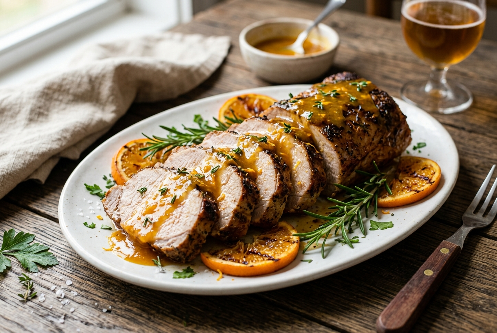

# Lombo Suíno ao Molho de Laranja 🍖🍊

Uma deliciosa peça de lombo suíno marinada com alecrim, assada no forno e servida fatiada com um molho encorpado e agridoce de laranja.

---

### ℹ️ Informações Gerais
- **Tempo de preparo:** 1 hora e 20 minutos (mais tempo de marinada)
- **Rendimento:** 10 porções
- **Categorias:** Salgado / Prato Principal / Forno

---

### 📷 Foto do Prato
  

---

### 🛒 Ingredientes

#### Lombo e Marinada
- [ ] 1 peça média de Lombo suíno (aprox. 1,2 kg a 1,5 kg)
- [ ] 1 colher (chá) de sal
- [ ] 2 colheres (chá) de Tempero SAZÓN® Profissional Alecrim (ou alecrim fresco picado com alho)
- [ ] 1 e 1/2 xícara (chá) de suco de laranja natural
- [ ] 1/2 xícara (chá) de vinho branco seco

#### Molho e Finalização
- [ ] 2 colheres (sopa) de manteiga sem sal
- [ ] 1 colher (sopa) de farinha de trigo
- [ ] 5 colheres (sopa) de suco de laranja (para dissolver a farinha)
- [ ] 1 colher (chá) de raspas de laranja
- [ ] Caldo que restou do cozimento do lombo assado (coado)

---

### 🍳 Modo de Preparo

#### Preparando e Assando o Lombo
1. Com o auxílio de uma faca afiada, faça furos por toda a peça de lombo.
2. Espalhe o tempero de alecrim (Sazón ou ervas/alho) e o sal sobre toda a carne.
3. Coloque em um recipiente, cubra e deixe marinar na geladeira de um dia para o outro (ou por pelo menos 4 horas).
4. Transfira o lombo para uma assadeira, regue com o suco de laranja e o vinho branco, e deixe descansar por 10 minutos antes de assar.
5. Cubra a assadeira com papel-alumínio e leve ao forno médio (180°C), preaquecido, por 1 hora. Na metade do tempo, regue o lombo com o caldo da assadeira.
6. Retire o papel-alumínio e devolva ao forno por mais 15 minutos, ou até que esteja dourado.
7. Retire do forno, transfira o lombo para uma travessa e corte em fatias finas. Reserve o caldo da assadeira.

#### Preparando o Molho
1. Coe 300 ml do caldo que se formou na assadeira e transfira para uma panela média.
2. Adicione a manteiga e a farinha de trigo (previamente dissolvida nas 5 colheres de suco de laranja).
3. Leve ao fogo baixo, mexendo de vez em quando, por cerca de 10 minutos ou até que o molho dê uma leve encorpada.

#### Montagem
1. Regue as fatias do lombo assado com o molho de laranja quente.
2. Salpique as raspas de laranja por cima para decorar e aromatizar. Sirva imediatamente.

---

### 💡 Dicas e Variações
- *Você pode decorar a travessa com rodelas de laranja grelhadas e ramos frescos de alecrim.*
- *Substitua o vinho branco seco por cachaça de boa qualidade para um toque mais brasileiro.*

---

📖 [« Voltar para o Índice Geral](../README.md) | 🍕 [« Voltar para o Índice de Salgados](INDEX_SALGADOS.md) | 📋 [« Voltar ao Índice Completo](INDEX_COMPLETO.md)
