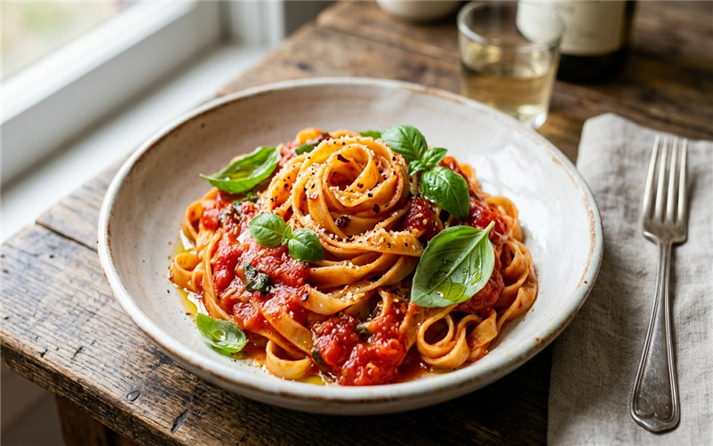

# Macarrão fresco com tomates pelados 🍝 📝

*Uma receita clássica italiana, simples e deliciosa, feita com tomates pelados e manjericão fresco.*

---

### ℹ️ Informações Gerais 📋
- **Tempo de preparo:** 45 minutos ⏱️
- **Rendimento:** 4 porções 🍽️
- **Categorias:** Salgados / Massas 🍝🍅

---

### 📷 Foto do Prato 🤤

---

### 🛒 Ingredientes 🧂

#### 🍝 Massa e Molho 🍝🍅
- [ ] 500g de espaguete (ou a massa fresca de sua preferência) 🌾
- [ ] 2 latas de tomate pelado (ou 1kg de tomates maduros sem pele e sem sementes) 🍅
- [ ] 4 colheres (sopa) de azeite de oliva 🫒
- [ ] 3 dentes de alho picados 🧄
- [ ] 1 cebola pequena picada 🧅
- [ ] Manjericão fresco a gosto 🌿
- [ ] Sal e pimenta-do-reino a gosto 🧂
- [ ] Queijo parmesão ralado para servir 🧀

---

### 🍳 Modo de Preparo 👩‍🍳

#### 🥘 Preparando o Molho 🥣
1. Em uma panela, aqueça o azeite e refogue a cebola até ficar transparente.
2. Adicione o alho picado e deixe dourar levemente, com cuidado para não queimar.
3. Acrescente os tomates pelados amassados. Tempere com sal e pimenta a gosto.
4. Deixe cozinhar em fogo baixo por cerca de 20 a 30 minutos, até que o molho encorpe. Adicione as folhas de manjericão fresco.

#### 🍝 Cozinhando a Massa e Finalização 🥣
1. Enquanto o molho apura, cozinhe o macarrão em uma panela grande com bastante água fervente e sal, até ficar *al dente*.
2. Escorra a massa e misture-a diretamente ao molho na panela, envolvendo bem.
3. Sirva imediatamente, polvilhando o queijo parmesão ralado por cima.

---

### 💡 Dicas e Variações ✨
- *Dica 1: Se o molho ficar muito ácido, adicione uma pitada de açúcar. 🍬*
- *Dica 2: Finalize com um fio de azeite extra virgem no prato para dar mais brilho e sabor. 🫒*

---

📖 [« Voltar para o Índice Geral](../INDEX.md) | 🍕 [« Voltar para o Índice de Salgados](INDEX_SALGADOS.md) | 📋 [« Voltar ao Índice Completo](INDEX_COMPLETO.md)

