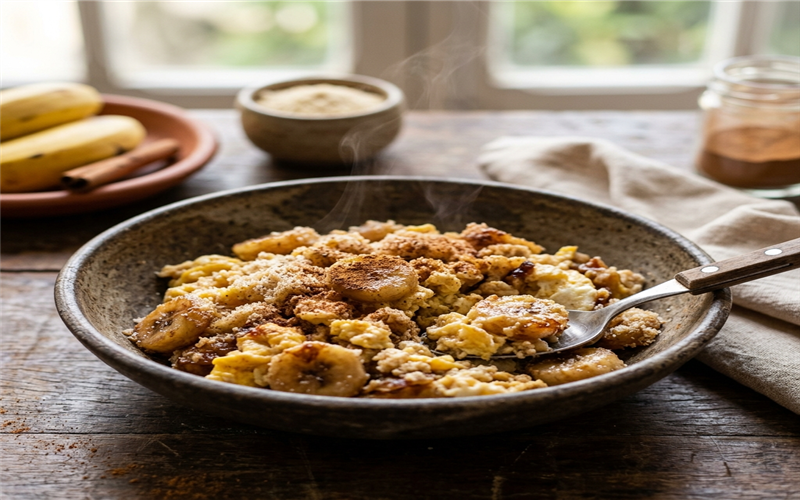

# Mexido de banana 🍌 📝

*Uma receita simples, rápida e deliciosa que mistura a doçura da banana caramelizada com o salgado do queijo derretido e a textura crocante da farinha de milho flocada.*

---

### ℹ️ Informações Gerais 📋
- **Tempo de preparo:** 15 minutos ⏱️
- **Rendimento:** 2 porções 🍽️
- **Categorias:** Lanches 🥪
- **Autor/Origem:** Kelly mara da silva 👩‍🍳

---

### 📷 Foto do Prato 🤤
  

---

### 🛒 Ingredientes 🧂

#### Ingredientes 🍌🧀
- [ ] 3 bananas nanica bem maduras
- [ ] 2 colheres de sopa de margarina
- [ ] 3 colheres de sopa de açúcar
- [ ] 100 g de queijo mussarela
- [ ] 3 colheres de farinha de milho flocada

---

### 🍳 Modo de Preparo 👩‍🍳

#### Preparo 🥣
1. Derreta a margarina em uma panela, em seguida coloque as bananas picadas em rodelinhas, o açúcar e mexa bem.
2. Acrescente o queijo mussarela e a farinha de milho flocada, misturando bem até que o queijo comece a derreter.

---

### 💡 Dicas e Variações ✨
- *Dica: Você pode usar farinha de mandioca como substituta se preferir outra textura. 🌾*
- *Variação: Adicione uma pitada de canela em pó para dar um toque aromático especial. 🍂*

---

📖 [« Voltar para o Índice Geral](../INDEX.md) | 🍰 [« Voltar para o Índice de Doces](INDEX_DOCES.md)

