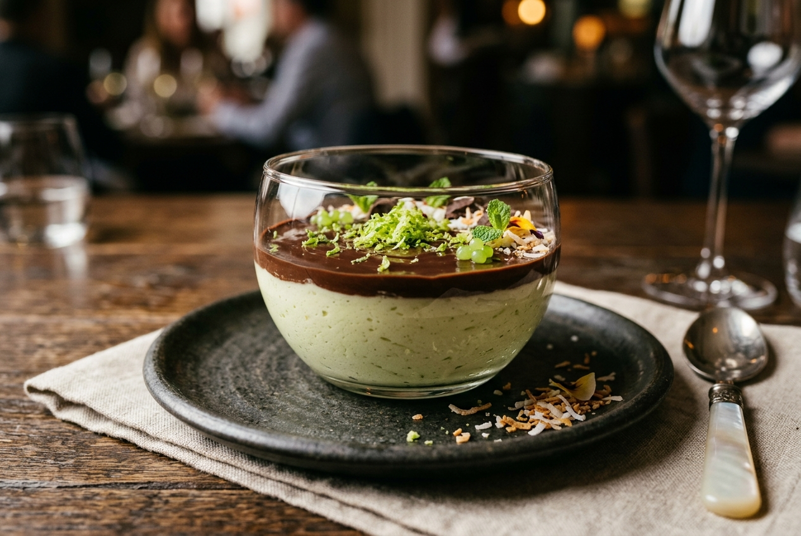

# Mousse de Limão com Chocolate 🍋🍫

Uma deliciosa combinação de mousse de limão azedinho e cremoso com uma cobertura de ganache de chocolate meio amargo. Perfeito para uma sobremesa rápida e sofisticada.

---

### ℹ️ Informações Gerais
- **Tempo de preparo:** 20 minutos (mais tempo de geladeira)
- **Rendimento:** 8 porções
- **Categorias:** Doce / Sobremesa / Gelado

---

### 📷 Foto do Prato
  

---

### 🛒 Ingredientes

#### Mousse de Limão
- [ ] 1 lata de leite condensado
- [ ] 1 caixa de creme de leite
- [ ] 1/2 copo americano de suco de limão concentrado

#### Cobertura
- [ ] 150 g de chocolate meio amargo
- [ ] 50 g de creme de leite

---

### 🍳 Modo de Preparo

#### Mousse de Limão
1. Coloque o leite condensado, o creme de leite e o suco de limão no liquidificador.
2. Bata por aproximadamente 2 minutos, para que fique bem homogêneo.
3. Despeje em uma tigela ou em taças individuais e reserve.

#### Cobertura
1. Derreta o chocolate meio amargo em banho-maria ou no micro-ondas (utilizando potência média e mexendo a cada 30 segundos para não queimar - leva cerca de 1 a 1 minuto e meio).
2. Adicione os 50 g de creme de leite ao chocolate derretido e misture bem até que fique homogêneo.
3. Espalhe a ganache de chocolate por cima da mousse reservada.
4. Leve à geladeira para firmar antes de servir.

---

### 💡 Dicas e Variações
- *Decore com raspas de limão por cima do chocolate para dar um toque especial de frescor e beleza.*
- *Se preferir uma ganache mais suave, pode usar chocolate ao leite, mas o meio amargo equilibra melhor o doce da mousse.*

---

📖 [« Voltar para o Índice Geral](../README.md) | 🍰 [« Voltar para o Índice de Doces](INDEX_DOCES.md) | 📋 [« Voltar ao Índice Completo](INDEX_COMPLETO.md)
