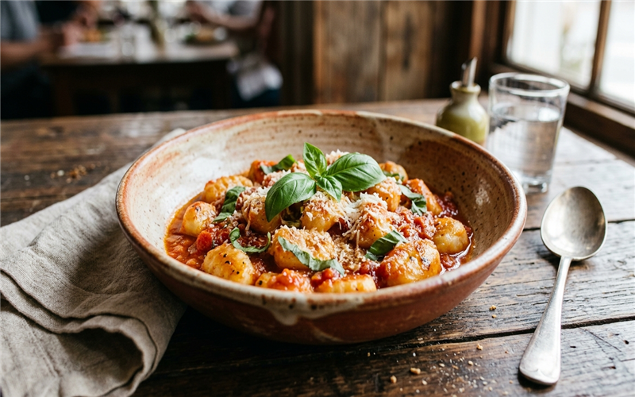

# Nhoque de Batata 🥔 📝

*Um prato clássico, fácil e delicioso para um almoço especial em família. Com batatas bem macias, este nhoque desmancha na boca!*

---

### ℹ️ Informações Gerais 📋
- **Tempo de preparo:** 45 minutos ⏱️
- **Rendimento:** 4 porções 🍽️
- **Categorias:** Salgado / Massa 🍝🥔

---

### 📷 Foto do Prato 🤤
  

---

### 🛒 Ingredientes 🧂

#### Massa 🥔🌾
- [ ] 6 batatas (preferencialmente do tipo Asterix) 🥔
- [ ] 1 xícara de farinha de trigo (aproximadamente) 🌾
- [ ] Sal a gosto 🧂

#### Acompanhamento 🍅🧀
- [ ] Molho de sua preferência (sugo, bolonhesa, branco, etc.) 🍅
- [ ] Queijo parmesão ralado a gosto 🧀

---

### 🍳 Modo de Preparo 👩‍🍳

#### Preparando a Massa 🥣
1. Cozinhe as batatas em água até que fiquem bem macias.
2. Descasque as batatas ainda quentes e passe-as por um espremedor, formando um purê.
3. Misture o purê de batata com o sal e vá acrescentando a farinha de trigo aos poucos.
4. Amasse bem até obter uma massa homogênea que não grude excessivamente nas mãos.
5. Coloque a massa sobre uma superfície enfarinhada, faça pequenos rolinhos e corte-os em pedaços de aproximadamente 2 cm.

#### Cozimento e Finalização 🔥
1. Leve uma panela grande com água e um pouco de sal ao fogo. Quando começar a ferver, adicione os nhoques aos poucos.
2. Assim que os nhoques subirem à superfície, retire-os imediatamente com uma escumadeira.
3. Transfira para um refratário e adicione o molho de sua preferência por cima.
4. Finalize polvilhando o queijo parmesão ralado a gosto e sirva.

---

### 💡 Dicas e Variações ✨
- *Dica 1: Para evitar que os nhoques grudem após cozidos, passe-os em uma bacia com água fria (choque térmico) logo após retirá-los da panela. 🧊*
- *Dica 2: Se quiser um sabor extra, você pode levar o nhoque já montado com molho e queijo ao forno para gratinar por alguns minutos. 🔥*
- *Dica 3: As batatas Asterix (da casca rosada) são ideais pois contêm menos água, exigindo menos farinha e deixando o nhoque muito mais leve. 🥔*

---

📖 [« Voltar para o Índice Geral](../README.md) | 🍕 [« Voltar para o Índice de Salgados](INDEX_SALGADOS.md) | 📋 [« Voltar ao Índice Completo](INDEX_COMPLETO.md)

