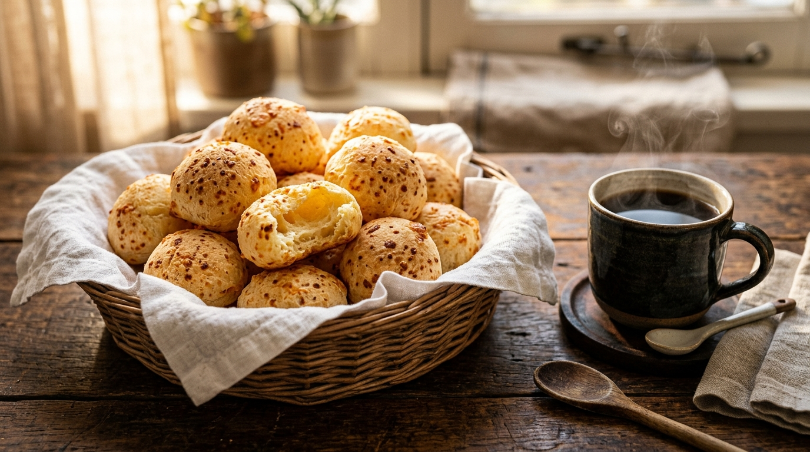

# Pão de Queijo Mineiro Tradicional 🧀 🥖 📝

*O autêntico e inconfundível pão de queijo das fazendas mineiras. Com casquinha dourada e crocante por fora e um miolo elástico, macio e repleto de queijo curado, carrega o aconchego de uma cozinha caipira, o cheiro de forno a lenha e a parceria perfeita com um bom café coado no pano na hora!*

---

### ℹ️ Informações Gerais 📋
- **Tempo de preparo:** 50 minutos ⏱️
- **Rendimento:** 35 a 40 unidades 🍽️
- **Categorias:** Salgado / Assado / Café da Manhã / Lanche 🧀☕

---

### 📷 Foto do Prato 🤤

---

### 🛒 Ingredientes 🧂

#### Base de Polvilho e Escaldamento 🌾🥛
- [ ] 250 g de polvilho doce 🌾
- [ ] 250 g de polvilho azedo 🌾
- [ ] 1 xícara (chá) de leite integral (240 ml) 🥛
- [ ] 1/2 xícara (chá) de óleo de girassol ou milho (120 ml) 🫗
- [ ] 1/2 xícara (chá) de água (120 ml) 💧
- [ ] 1 colher (sopa) rasa de sal (aprox. 10 g) 🧂

#### Massa e Queijos 🧀🥚
- [ ] 2 a 3 ovos médios em temperatura ambiente (preferencialmente caipiras) 🥚
- [ ] 350 g de queijo Minas Meia Cura ou Queijo Canastra ralado no ralo grosso 🧀
- [ ] 50 g de queijo Parmesão curado ralado fininho (opcional, para acentuar o aroma) 🧀
- [ ] Óleo vegetal para untar as mãos ao bolear 🫒

---

### 🍳 Modo de Preparo 👩‍🍳

#### 1. Escaldando o Polvilho ♨️🥣
1. Em uma tigela grande ou bacia esmaltada resistente ao calor, misture o polvilho azedo, o polvilho doce e o sal. Reserve.
2. Em uma panela pequena, junte o leite, a água e o óleo. Leve ao fogo médio e desligue assim que atingir fervura completa e começar a borbulhar.
3. Despeje o líquido fervente imediatamente e com cuidado sobre a mistura de polvilhos.
4. Misture vigorosamente com uma colher de pau ou espátula até hidratar todo o polvilho, formando uma farofa úmida com alguns grumos.
5. Deixe a massa amornar por 15 a 20 minutos até ficar em temperatura ambiente ao toque (nunca coloque os ovos com a massa quente para evitar que cozinhem).

#### 2. Sovando e Incorporando os Ingredientes 🥣🧀
1. Desmanche os gruminhos da massa morna com as pontas dos dedos.
2. Adicione os ovos um a um, sovando com as mãos a cada adição para que a massa absorva o líquido. *Dica:* dependendo do tamanho dos ovos e da umidade do polvilho, 2 ovos podem bastar; adicione o 3º ovo aos poucos apenas se a massa estiver muito firme.
3. Acrescente o queijo Meia Cura ralado grosso e o queijo parmesão.
4. Sove a massa com firmeza por cerca de 3 a 5 minutos até obter uma textura uniforme, brilhante, macia e ligeiramente pegajosa (o ponto correto não é ressecado).

#### 3. Modelagem e Forno 🔥🍽️
1. Preaqueça o forno a 200 °C por pelo menos 15 a 20 minutos.
2. Unte as palmas das mãos com algumas gotas de óleo.
3. Com o auxílio de uma colher de sopa, retire porções de massa e molde bolinhas de aproximadamente 3 a 4 cm de diâmetro (cerca de 30 g a 35 g cada).
4. Distribua as bolinhas em uma assadeira grande, deixando cerca de 3 cm de distância entre elas para crescerem sem grudar. Não é necessário untar a assadeira se ela for antiaderente, mas pode-se untar com um fio sutil de óleo ou forrar com papel manteiga.
5. Leve ao forno preaquecido a 200 °C e asse por 25 a 30 minutos, até que estejam bem inflados, leves e com a casca douradinha com pontinhos crocantes de queijo.
6. Retire do forno e sirva bem quentinho acompanhado de um cafezinho recém-passado!

---

### 💡 Dicas e Variações ✨
- *O segredo da textura perfeita:* A mistura de 50% de polvilho doce e 50% de polvilho azedo é o equilíbrio ideal. O polvilho azedo faz o pão crescer, ficar aerado e com a casquinha estaladiça, enquanto o polvilho doce confere elasticidade e aquela maciez "puxa-puxa" por dentro. 🌾
- *A escolha do queijo:* O queijo ideal é o Meia Cura artesanal ou Canastra bem curado. Evite queijo minas frescal (pois solta soro em excesso e desanda a massa) ou muçarela pura (que deixa a massa pesada e borrachuda). Ralar no ralo grosso cria deliciosos flocos de queijo tostado na casquinha. 🧀
- *Forno sempre bem quente:* O choque térmico inicial é essencial para que o polvilho se expanda e asse adequadamente. Nunca asse pão de queijo em forno morno. ♨️
- *Como congelar:* Disponha as bolinhas cruas modeladas em uma forma e leve ao freezer por 2 horas até empedrar. Depois, transfira para saquinhos herméticos. Conserva-se perfeito por até 3 meses. Para assar, leve diretamente do freezer ao forno preaquecido a 190 °C–200 °C por cerca de 30 a 35 minutos. ❄️
- *Variação recheada:* Antes de fechar a bolinha, insira um cubinho de goiabada cascão ou requeijão cremoso bem gelado para um surpreendente contraste de sabores. 🍯

---

📖 [« Voltar para o Índice Geral](../README.md) | 🍕 [« Voltar para o Índice de Salgados](INDEX_SALGADOS.md) | 📋 [« Voltar ao Índice Completo](INDEX_COMPLETO.md)
