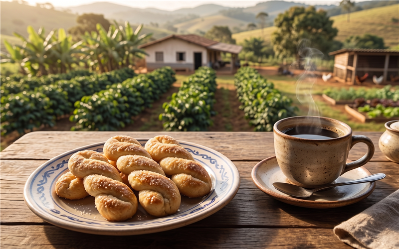

# Rosquinha de Queijo 🧀 📝

*Com gostinho de casa de vó, essa rosquinha de queijo arranca suspiros de todo mundo que experimenta e traz as memórias mais doces da infância!*

---

### ℹ️ Informações Gerais 📋
- **Tempo de preparo:** 40 minutos ⏱️
- **Rendimento:** 30 porções 🍽️
- **Categorias:** Doces / Assado 🍩🧀

---

### 📷 Foto do Prato 🤤
  

---

### 🛒 Ingredientes 🧂

#### Massa 🥖🧀
- [ ] 5 ovos 🥚
- [ ] 125 g de manteiga sem sal 🧈
- [ ] 125 g de açúcar 🍬
- [ ] 160 g de queijo minas meia cura (ralado) 🧀
- [ ] 25 g de fermento químico em pó 🧁
- [ ] 600 g de farinha de trigo 🌾

---

### 🍳 Modo de Preparo 👩‍🍳

#### Preparando a Massa 🥣
1. Em uma batedeira, coloque os ovos, a manteiga em temperatura ambiente e o açúcar, e bata muito bem.
2. Adicione o queijo ralado e bata novamente.
3. Junte o fermento e dê uma leve batida.
4. Acrescente a farinha aos poucos e vá misturando com as mãos.
5. Sove até obter uma massa lisa e que não grude nas mãos.

#### Modelagem e Assamento 🔥
1. Modele as rosquinhas e acomode em uma forma untada.
2. Leve para assar em forno preaquecido a 200 °C por vinte minutos.
3. Vire as rosquinhas e leve para assar por mais vinte minutos, ou até dourarem.

---

### 💡 Dicas e Variações ✨
- *Dica 1: O segredo é investir em um queijo minas meia cura de qualidade. 🧀*
- *Dica 2: Faça uma calda de água com açúcar e baunilha, passe por cima dos doces assim que estiverem mornos e depois passe no açúcar de confeiteiro. 🍯*

---

📖 [« Voltar para o Índice Geral](../README.md) | 🍰 [« Voltar para o Índice de Doces](INDEX_DOCES.md) | 📋 [« Voltar ao Índice Completo](INDEX_COMPLETO.md)

